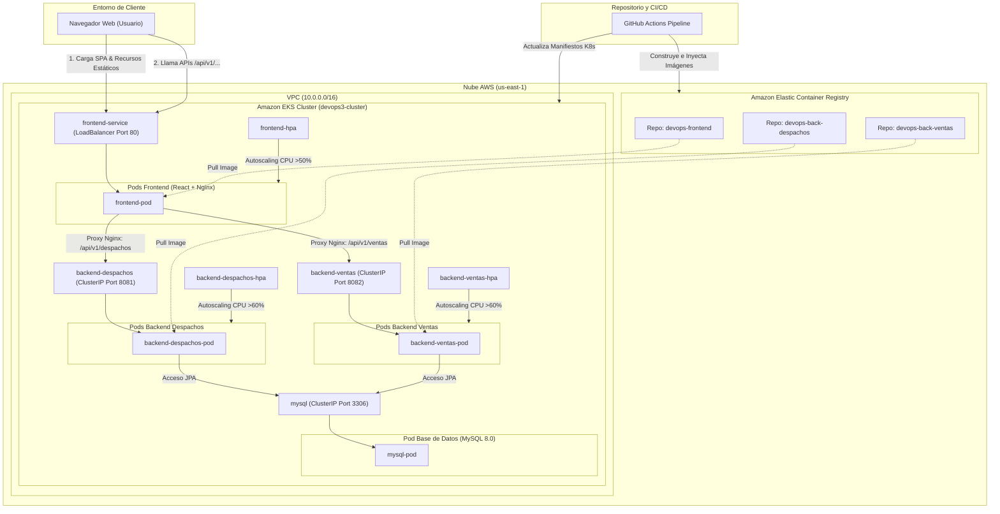

#  Ecosistema DevOps: Arquitectura de Microservicios en AWS

[](#)
[](#)
[](#)
[](#)
[](#)
[](#)

## 📋 Descripción General

Este repositorio contiene la definición completa de infraestructura, orquestación y código fuente para un sistema de microservicios transaccional. El proyecto implementa un flujo de trabajo **DevOps** moderno, garantizando despliegues automatizados, infraestructura inmutable y alta disponibilidad en la nube de Amazon Web Services (AWS).

La solución soporta las operaciones de un sistema de Ventas y Despachos, integrando un frontend interactivo, APIs robustas y persistencia de datos segura, todo gestionado bajo un pipeline de Integración y Entrega Continua (CI/CD).

---

##  Arquitectura y Tecnologías

El ecosistema está diseñado para ser tolerante a fallos y altamente escalable:



* **Infraestructura como Código (IaC):** Aprovisionamiento automatizado de VPCs, Subredes y el clúster principal utilizando **Terraform**.
* **Orquestación de Contenedores:** Gestión centralizada de microservicios mediante **Amazon EKS** (Elastic Kubernetes Service).
* **Registro de Imágenes:** Almacenamiento privado y seguro de artefactos Docker en **Amazon ECR**.
* **Autoscalado Dinámico:** Implementación de Horizontal Pod Autoscaler (HPA) en Kubernetes para escalar réplicas basándose en umbrales de CPU (>60%).
* **Frontend:** Aplicación interactiva construida con **React**.
* **Backend:** Microservicios independientes desarrollados con **Java Spring Boot** (API REST Ventas y API REST Despachos).
* **Base de Datos:** Motor relacional **MySQL** desplegado internamente en el clúster con volúmenes persistentes.

---

##  Requisitos Previos del Sistema

Para ejecutar, modificar o desplegar este proyecto en un nuevo entorno, se requiere la instalación de las siguientes herramientas:

* Git CLI
* Docker Desktop (con el clúster local de Kubernetes habilitado)
* Terraform CLI (v1.0.0 o superior)
* AWS CLI configurado con credenciales válidas
* Kubectl configurado para la versión correspondiente del clúster EKS

---

##  Guía de Despliegue (AWS EKS)

Siga estos pasos estructurados para aprovisionar y desplegar el sistema completo en la nube.

### 1. Autenticación de AWS
Configure las variables de entorno en su terminal con credenciales válidas (formato PowerShell):
```powershell
$env:AWS_ACCESS_KEY_ID="SU_ACCESS_KEY"
$env:AWS_SECRET_ACCESS_KEY="SU_SECRET_KEY"
$env:AWS_SESSION_TOKEN="SU_SESSION_TOKEN"

2. Aprovisionamiento de Infraestructura
Levante los recursos base (VPC, EKS, ECR) ejecutando Terraform en el directorio correspondiente:
cd infra
terraform init
terraform apply

3. Configuración del Contexto de Kubernetes
Enlace su terminal local con el clúster recién creado en AWS:
aws eks update-kubeconfig --region us-east-1 --name devops3-cluster
kubectl apply -f infra/k8s/

Integración y Entrega Continua (CI/CD)
El proyecto cuenta con un pipeline automatizado definido en .github/workflows/cd.yml. Cada integración de código a la rama principal (main) dispara el siguiente flujo:

Validación de credenciales inyectadas de forma segura vía GitHub Secrets.

Autenticación automática con el registro de Amazon ECR.

Compilación nativa y empaquetado de los tres microservicios en imágenes Docker (:latest).

Publicación segura de los artefactos en la nube.

Actualización continua de los pods en el clúster EKS asegurando una transición sin interrupciones (Zero Downtime Deployment).
Comandos Operativos y de Monitoreo
Para validar la salud del sistema o realizar troubleshooting, utilice las siguientes instrucciones:

Validar el estado de los microservicios: kubectl get pods

Consultar el balanceador de carga y obtener la URL pública: kubectl get svc frontend-service

Revisar métricas de escalamiento automático: kubectl get hpa

Extraer logs de un contenedor específico: kubectl logs -f <nombre-del-pod>
Autor
Daniel Eduardo Cifuentes Huenten
Ingeniería y Desarrollo Full-Stack | Arquitectura DevOps
